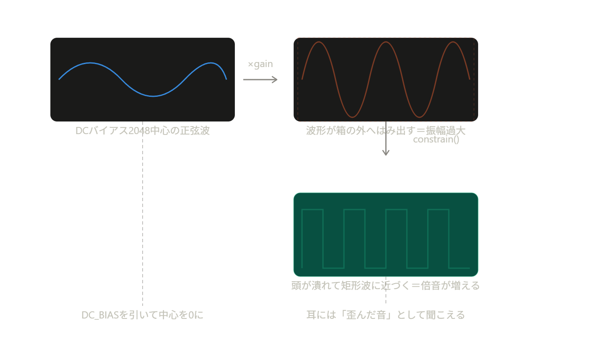
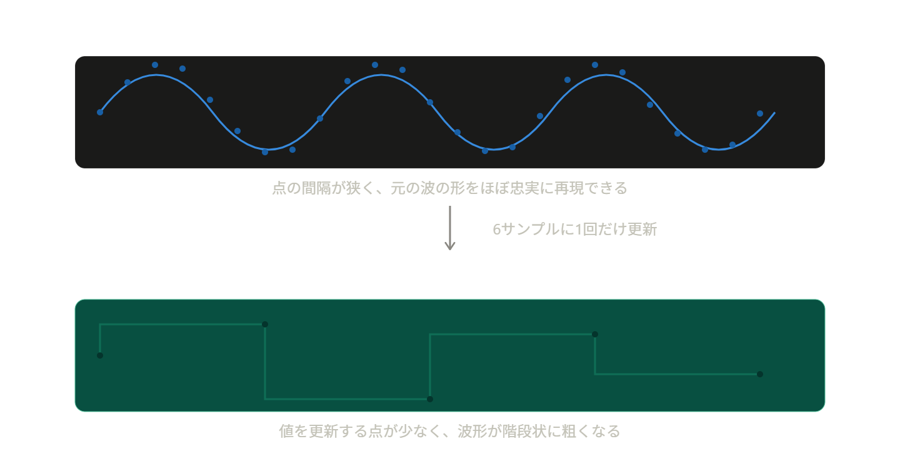
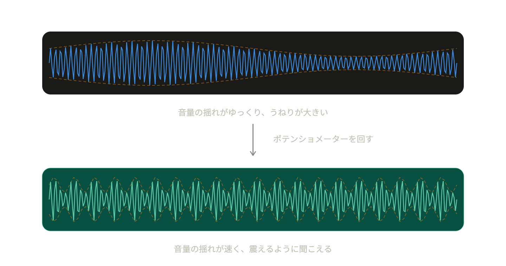
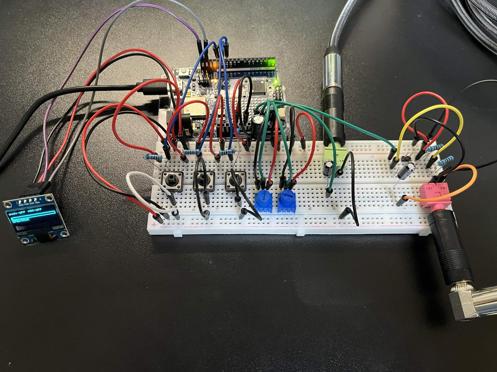
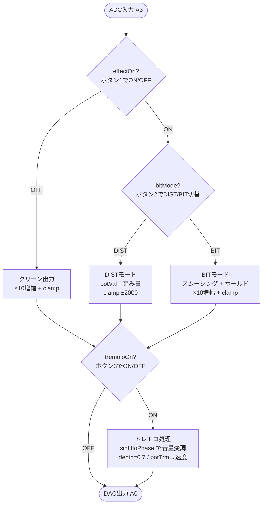

# 個人開発プロジェクト

## 概要

Arduino UNO R4 Wifiを用いた、エレキギターの多機能エフェクター制作

### エフェクト OFF

[▶ クリーン音声を再生](movie&sound/clean-1.mp3)

<audio controls src="clean-1.mp3" title="Title"></audio>

### エフェクト ON

[▶ ディストーション音声を再生：音量注意](movie&sound/distortion-1.mp3)

<audio controls src="distortion-1.mp3" title="Title"></audio>

## 主な機能

- クリッピングを使用したディストーション機能
- ローパスフィルタとサンプルホールドを使用したビット音エフェクト機能
- LFOによる音量変調を使用したトレモロ機能
- ボタンによるエフェクトのON/OFF、切り替え
- ポテンションメータによる歪み量の増減、トレモロの速さの変更
- OLEDディスプレイの現在のエフェクトの表示、レベルメーターの表示、スペクトラム表示

### エフェクト機能の詳細



**歪みの原理（物理的な話）**  

    普通のアナログのディストーションペダルは、
    信号を許容範囲を超えて増幅すると、回路の限界で波形の頭が潰れる（クリップする）
    ことを利用しています。

    正弦波の頭が潰れて矩形波に近づくと、
    元の音にはなかった倍音（高調波）が大量に生まれます。
    これが「歪んだ音」の正体です。
    
    つまり、
    増幅 → 上限/下限で強制的に切り取る（クリッピング） → 波形が角ばる → 倍音が増える → 歪んで聞こえる

**コード上の実装**  

```cpp
float distortion = map(POT, 0, 4095, 1, 100);
int   centered   = raw - DC_BIAS;
float amp        = centered * distortion;
float clipped    = constrain(amp, -2000, 2000);
out = constrain((int)clipped + DC_BIAS, 0, 4095);
```

| コード | 意味 | 図の対応 |
| --- | --- | --- |
| `distortion = map(POT, 0, 4095, 1, 100)` | ポテンショメータの読み取り値（0〜4095）を、ゲイン倍率1〜100の範囲に変換する | — |
| `centered = raw - DC_BIAS` | ADCは0〜4095の正の値しか扱えないので、中点2048を引いて信号を0中心の交流信号に戻す | 図1 |
| `amp = centered * distortion` | ポテンショメータの値（1〜100倍）でゲインをかける＝わざと振幅を大きくする | 図2 |
| `clipped = constrain(amp, -2000, 2000)` | ±2000を超えた部分を強制的に切り捨てる＝これが「クリッピング」そのもの | 図3 |
| `out = ... + DC_BIAS` | DACに戻すため再びDCバイアスを足して0〜4095に収める | — |

**ビット音エフェクトについて**

サンプリングレート(Hz)を下げることによってカクついた音を作成

- コード全体では```#define SAMPLE_RATE 20000.0f```なので、1秒官に20,000回(20,000Hz)音声の入力を測っている

```cpp
if (holdCount++ >= 6) {
  holdVal = smoothedRaw;
  holdCount = 0;
}
```

- この処理は6回に1回しか値を更新しない＝残り5回は同じ値を使い回す、という動きをします。
- これは実質的に、サンプリングレートを 20,000Hz ÷ 6 ≒ 約3,333Hz相当まで落としているのと同じ効果になります。



**トレモロ機能について**

トレモロは、音の波形そのものを変えるのではなく、音量を周期的に上下させるエフェクトです。

- このエフェクターではトレモロのスピードを調整することができます。



```cpp
float tremoloHz = 0.5f + (currentTrm / 4095.0f) * 9.5f;
```

ポットの値（0〜4095）を0.5Hz〜10Hzの範囲に変換している

```cpp
float lfo = 1.0f - depth + depth * (sinf(lfoPhase) + 1.0f) * 0.5f;
int modulated = (int)(centered * lfo);
```

lfoが図の点線の高さそのもの（0.3〜1.0の範囲で往復）で、それを元の音声信号に掛け算することで、点線の形どおりに実線の振幅が変化する、という仕組みです。

「DIST/BITは波形の"形"を変える処理、トレモロは波形の"大きさ"を時間方向に揺らす処理」

## 仕様書

### 使用モジュール

| 部品                                        | 個数 | 用途                                                                                                                                          | 接続ピン                                                                 |
| ------------------------------------------- | ---- | --------------------------------------------------------------------------------------------------------------------------------------------- | ------------------------------------------------------------------------ |
| Arduino UNO R4 Wifi                         | 1個  | 制御                                                                                                                                          | USBケーブル                                                              |
| φ3.5mm ステレオジャック                     | 2個  | 音声の入出力                                                                                                                                  | 入力ジャック,  出力ジャック<br>1pin：GND,  GND<br>2pin：A3,  A0          |
| φ6.3mm ステレオ→φ3.5mm ステレオ変換アダプタ | 2個  | 音声の入出力                                                                                                                                  | φ3.5mm ステレオジャック                                                  |
| OLEDディスプレイ                            | 1個  | エフェクトの表示                                                                                                                              | SCK：SCL<br>SDA：SDA<br>VCC：5V<br>GND：GND                              |
| ポテンションメータ（POT）                   | 2個  | ポテンションメータ1（左）：歪み量<br>ポテンションメータ2（右）：トレモロの速さの変更                                                          | POT1, POT2<br>中央の端子：A1, A2<br>右端の端子：5V<br>左端の端子：GND    |
| ボタン                                      | 3個  | ボタン1（左端）：DIST/BITエフェクトの切り替え<br>ボタン2（中央）：エフェクトのON/OFF切り替え<br>ボタン3（右端）：トレモロ機能のON/OFF切り替え | ボタン1, ボタン2, ボタン3<br>1pin：D13, D12, D11<br>4pin：GND<br>VCC：5V |
| 抵抗器（10kΩ）                              | 5個  | 2.5Vのバイアス回路用（2個）<br>ボタン用（3個）                                                                                                | ---                                                                      |
| 電解コンデンサ（10μF）                      | 2個  | 入出力ジャックの直流カット                                                                                                                              | 入出力ジャック2pin |
| 電解コンデンサ（100μF）                     | 1個  | 電源ノイズの削減                                                                                                                              | アノード（＋）：共通VCC<br>カソード（ー）：共通GND                       |
| 積層セラミックコンデンサ（100nF）           | 1個  | 電源ノイズの削減                                                                                                                              | アノード（＋）：共通VCC<br>カソード（ー）：共通                          |

### 配線図




### 簡単なフローチャート



### OLEDの表示について


https://github.com/user-attachments/assets/77500b7e-669f-4713-81d7-794079ee29de

#### 表示内容

- ボタン1でDIST/BITのエフェクト切り替えを表示
- ボタン2でエフェクトのON/OFFの切り替えを表示
- ボタン3でトレモロのON/OFF切り替えを表示
- ポテンションメータ1を使用するとDISTの値が増減
- ポテンションメータ2を使用するとSPDの値が増減
- 音量が上がるとレベルメーターが伸びる
- 音声入力をFFTで周波数分析し、16バンドのスペクトラムをリアルタイム表示

### Webサイトの表示と操作について

https://github.com/user-attachments/assets/5a5958d6-1df3-4569-b857-d2d97f1ba7ac

- 操作モード：クリックによってエフェクトが操作できる
- プリセットモード：5個のスロットに現在のエフェクトを保存・呼び出しできる
- 表示モード：手元のボタンとポテンションメーターによるエフェクトの操作がリアルタイムで表示される

## エフェクトのデモ映像

### エフェクト：OFF | トレモロ：OFF

https://github.com/user-attachments/assets/4f64bd10-a963-434a-b759-07e373d1536b

### エフェクト：DIST | トレモロ：OFF

https://github.com/user-attachments/assets/49938672-ceab-4d99-b9e4-31efc051a8b6

### エフェクト：DIST | トレモロ：ON

https://github.com/user-attachments/assets/9d42fd63-4694-455f-bf32-313f81b13449

### エフェクト：BIT | トレモロ：OFF

https://github.com/user-attachments/assets/e652b76a-b20f-4a3e-9a72-bca1a967dc92

### エフェクト：BIT | トレモロ：ON

https://github.com/user-attachments/assets/8b2b93d4-f295-447f-923e-5ce478550a49


## ソフトウェア

### 標準ライブラリ

- Wire.h — I2C通信
- math.h — sinf()、M_PIなど数学関数
- EEPROM.h — 不揮発性メモリへの読み書き（プリセット5件の保存・読込用）

### 追加ライブラリ

- Adafruit_GFX.h — ディスプレイ用グラフィックス基底ライブラリ
- Adafruit_SSD1306.h — SSD1306 OLEDディスプレイドライバ
- FspTimer.h — RA4M1チップの高精度タイマー制御（割り込み）
- arduinoFFT.h — 高速フーリエ変換（スペクトラム表示用）※v2.x系必須
- WiFiS3.h — Arduino UNO R4 WiFi用Wi-Fi通信ライブラリ（ボードパッケージに同梱、追加インストール不要）

### 自作ヘッダーファイル

- mywifi.h — Wi-Fi接続情報（WIFI_SSID, WIFI_PASS）を定義する自作ファイル。ソースコードには含まれないため、各自で作成しスケッチと同じフォルダに配置する必要がある

## 参考サイト

- Claude
- [音楽用エフェクター設計に役立つ回路集](https://xs990050.xsrv.jp/effector/etc/circuits/circuits.php)
