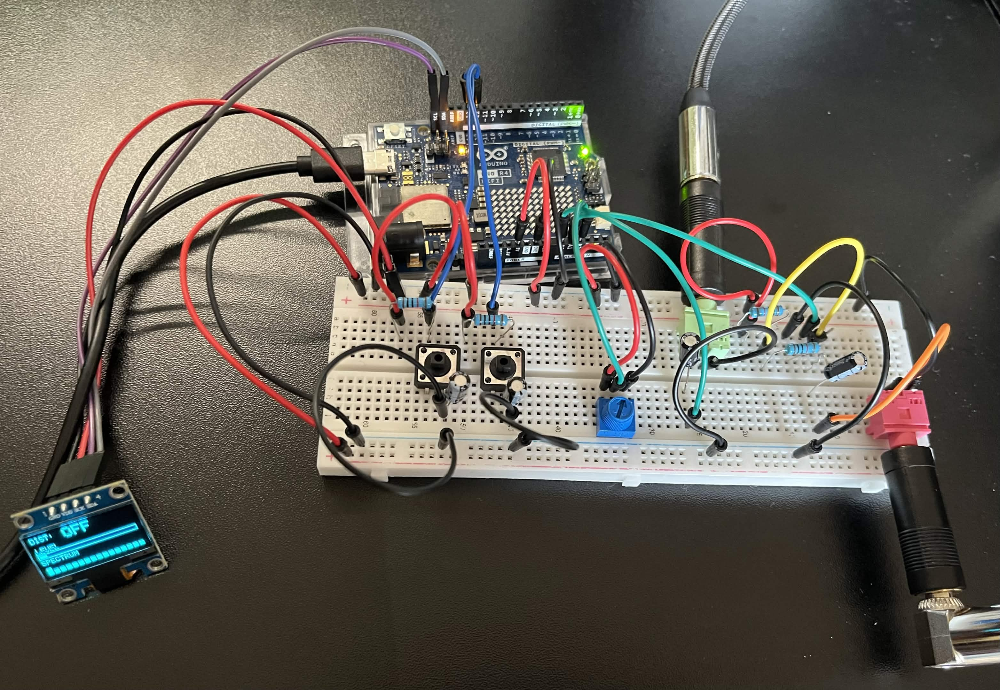
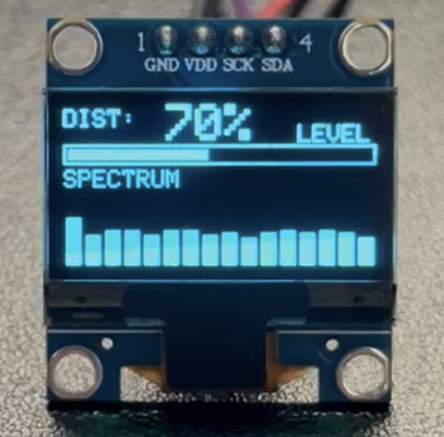
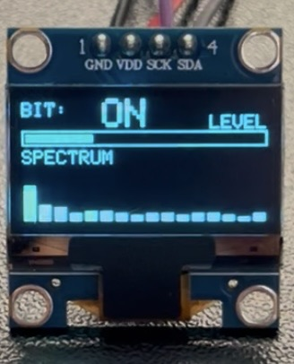

# 個人開発プロジェクト

## 概要

Arduino UNO R4 Wifiを用いた、エレキギターのエフェクター制作

### エフェクト OFF

[▶ クリーン音声を再生](https://github.com/sishii2026-ctr/effector/raw/main/clean.m4a)

### エフェクト ON

[▶ ディストーション音声を再生](https://github.com/sishii2026-ctr/effector/raw/main/distortion.m4a)

## 主な機能

- クリッピングを使用したディストーション機能
- ローパスフィルタとサンプルホールドを使用したビット音エフェクト機能
- ボタンによるエフェクトのON/OFF
- ポテンションメータによる歪み量の増減
- OLEDディスプレイの歪み量、レベルメーターの表示、スペクトラム表示

## 配線図

## OLED

- ポテンションメータを使用するとDISTの値も増減
- ボタン1でON/OFFの切り替えを表示
- ボタン2でDIST/BITのエフェクト切り替えを表示
- 音量が上がるとレベルメーターが伸びる
- 音声入力をFFTで周波数分析し、16バンドのスペクトラムをリアルタイム表示