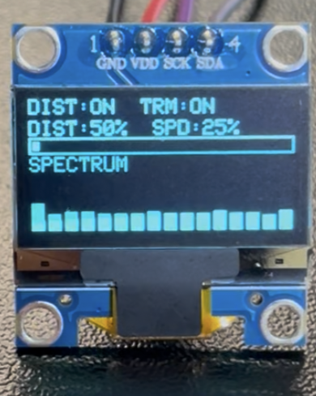
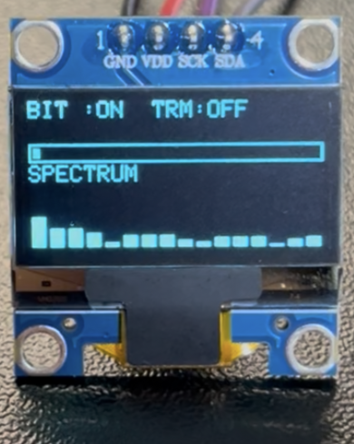

# 個人開発プロジェクト

## 概要

Arduino UNO R4 Wifiを用いた、エレキギターのエフェクター制作

### エフェクト OFF

▶ クリーン音声を再生

<audio controls src="clean-1.mp3" title="Title"></audio>

### エフェクト ON

▶ ディストーション音声を再生：音量注意

<audio controls src="distortion-1.mp3" title="Title"></audio>

## 主な機能

- クリッピングを使用したディストーション機能
- ローパスフィルタとサンプルホールドを使用したビット音エフェクト機能
- LFOによる音量変調を使用したトレモロ機能
- ボタンによるエフェクトのON/OFF、切り替え
- ポテンションメータによる歪み量の増減、トレモロの速さの変更
- OLEDディスプレイの現在のエフェクトの表示、レベルメーターの表示、スペクトラム表示

## 配線図

## OLED

### 表示内容

- ボタン1でDIST/BITのエフェクト切り替えを表示
- ボタン2でエフェクトのON/OFFの切り替えを表示
- ボタン3でトレモロのON/OFF切り替えを表示
- ポテンションメータ1を使用するとDISTの値が増減
- ポテンションメータ2を使用するとSPDの値が増減
- 音量が上がるとレベルメーターが伸びる
- 音声入力をFFTで周波数分析し、16バンドのスペクトラムをリアルタイム表示